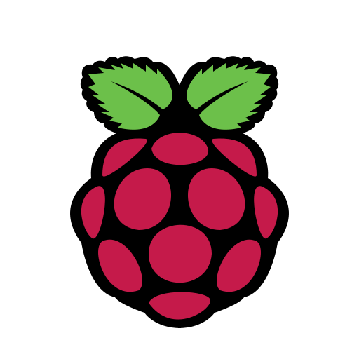
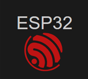

# 👨‍💻 توسعه‌دهنده اندروید و الکترونیک

سلام! من یک توسعه‌دهنده‌ی اندروید و متخصص الکترونیک هستم که عاشق ساخت و طراحی پروژه‌های نرم‌افزاری و سخت‌افزاری خلاقانه‌ام. از توسعه اپلیکیشن‌های اندرویدی تا طراحی بردهای الکترونیکی و کار با IOT و سیستم‌های کنترلی، مسیر کاری‌ام همواره با یادگیری، تجربه و حل چالش‌های فنی همراه بوده است.

---

## 📱 مهارت‌های برنامه‌نویسی اندروید

- مسلط به زبان‌های **Java** و **Kotlin**
- مسلط به **SQL** و دیتابیس‌ها
- مسلط به **REST APIs**، **LiveData**، **DataBinding** و **Dependency Injection**
- آشنا به الگوهای طراحی (**Design Patterns**)
- تجربه‌ی کامل در کار با پروتکل‌های **Bluetooth**، **WiFi** و **USB**
- تخصص در توسعه اپلیکیشن برای **IOT** و ارتباط با سخت‌افزار
- تجربه کار روی **Embedded Boards** مثل **Firefly** و **Raspberry Pi**
- طراحی و توسعه‌ی اپلیکیشن‌های:
  - کنترل LED هوشمند
  - کنترل اجزای خودرو
  - ارتباط با دستگاه‌های باسکول دیجیتال
- توانایی انجام هر نوع پروژه اندرویدی از صفر تا صد

---

## 🔧 الکترونیک و سیستم‌های امبدد

- تسلط به مبانی **الکترونیک**
- مسلط به نرم‌افزار **Altium Designer** برای طراحی بردهای:
  - تک‌لایه، دولایه و چندلایه
- آشنا به زبان‌های برنامه‌نویسی **C** و **C++**
- تجربه کار با میکروکنترلرهای **AVR**، **ARM**، **ESP**
- برخی پروژه‌های انجام‌شده:
  - ربات تعقیب خط
  - سیستم دنبال‌کننده خورشید با ارسال اطلاعات از طریق WiFi
  - کوره القایی
  - طراحی سخت‌افزار دستگاه RF زیبایی
  - همکاری در ساخت دستگاه‌های پزشکی
  - تجربه مهندسی معکوس

---

## 🧠 مهارت‌های فردی

- علاقه‌مند به یادگیری تکنولوژی‌های جدید
- توانایی حل مسائل فنی پیچیده
- مسلط به **Git** و همکاری تیمی

-----

## 📫 ارتباط با من

برای همکاری یا دیدن پروژه‌های بیشتر، خوشحال می‌شم از طریق گیت‌هاب یا ایمیل <alireza.karami.work@gmial.com> با من در تماس باشید 😊

---

### ⚙️ ابزارها و زبان‌هایی که با آن‌ها کار کرده‌ام:
 
  

    
  
  
  
  
  
  
  
  
  

